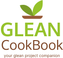

  

 
 
&nbsp Glean Cookbook is a recipe cookbook application for the web e-commerce platform Glean Store,
as a part of the Glean Project– a movement that aims to promote the local farming industry and prevent
crop wastage. To preface, the latter is a website where customers can buy fresh and local pre-portioned
ingredients from a variety of healthy dishes to be delivered right to their doorstep. Glean Cookbook
provides users with easy to follow steps on how to properly cook meals they have bought from Glean
Store.
 
 
 

<h2> Promotional Video </h2>

  <video autoplay src="https://user-images.githubusercontent.com/71896007/200113356-5e0db2d4-b565-448d-896c-5c8e05cd6436.mp4" controls="controls"" > </video>

 

    <h2>Technologies Used</h2>
    <ul>
        <li><a href="https://flutter.dev/">Flutter</a></li>
        <li><a href="https://dart.dev/">Dart</a></li>
        <li><a href="https://firebase.google.com/">Firebase</a></li>
    </ul>

 

   <h2>Local Development</h2>

   <h3>Clone the repository</h3>
   In your prefered working directory open a terminal and type:
     
  
    git clone https://github.com/m-visaya/Glean-Cookbook.git
  
    
   <h3>Install the dependencies</h3>
   Install flutter dependencies
     
  
    flutter pub get

    
   <h3>Run the app</h3>
   Depending on your OS and your installation, Flutter will ask you which target you want to use.
     
  
    flutter run

 

    <h2>Acknowledgments</h2>
    Promotional Video
    <ul>
        <li><a href="https://github.com/rcbern">@rcbern</a></li>
        <li><a href="https://github.com/BKManabat">@BKManabat</a></li>
    </ul>

 

    <h2>License</h2>
    Distributed under the GPL3 License. See LICENSE for more information.

